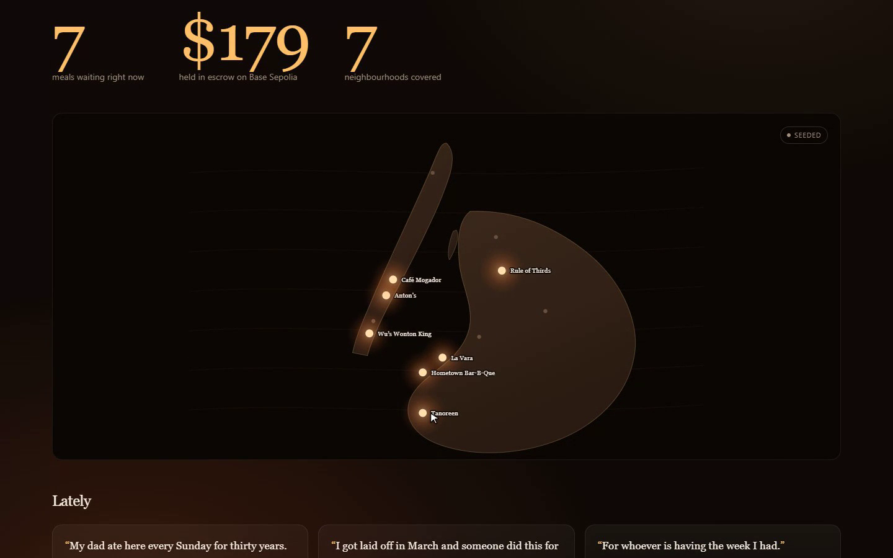
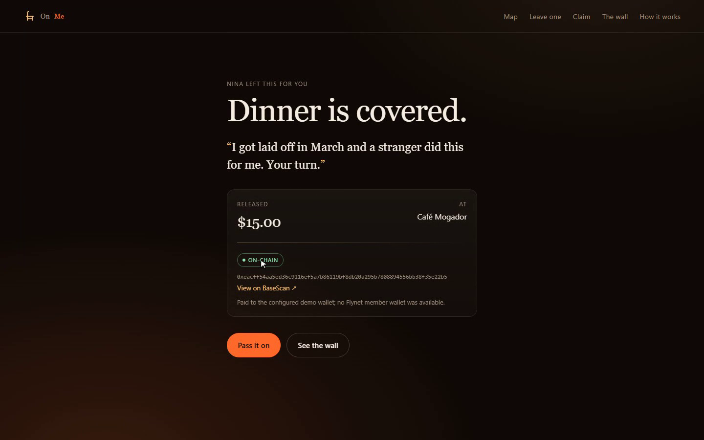

# On Me

**Leave dinner for someone you will never meet.**

Pay for a meal at a restaurant you love and leave it there. The next person who walks in and needs
it eats. No account, no means test, no thanks owed.

Built for [Runtime](https://runtime.nyc/) — Blackbird / Flynet track, Dynamic track, and the Bankr
grand prize.

**Live demo: [on-me-five.vercel.app](https://on-me-five.vercel.app)** — claims there release real testnet USDC on Base Sepolia.



---

## Why this

Suspended coffee — *caffè sospeso* — has existed in Naples for about a century. You pay for two
coffees, drink one, and someone who needs it drinks the other. It never scaled past the
neighbourhood, for one reason: it needs a shopkeeper everybody trusts to actually hand the second
coffee over.

That is a trust problem, and it is the one thing this stack is genuinely good at solving.

Gift cards are the incumbent answer and they are a bad financial instrument: single-merchant,
non-transferable, and roughly $3B a year expires unredeemed. A suspended meal is the opposite — it
is only ever worth something to the person who needs it.

## The primitive

**An escrowed meal, released by proof of presence.**

```
giver funds escrow ──▶ meal waits at a venue ──▶ claimer checks in on Blackbird
                                                          │
                                        Flynet check-in at that location
                                                          │
                                                          ▼
                                          escrow releases USDC to the claimer
```

Nobody can move the money — not the giver, not the restaurant, not us. The only key is a Flynet
check-in at the venue named on the meal, inside a freshness window. Presence is the authorisation.

Change who is allowed to claim and the same escrow becomes three different products:

| Claim rule | Product | What it feels like |
|---|---|---|
| anyone | **On Me** | generosity to a stranger |
| one named member | **Care Package** | someone who loves you buys you dinner |
| anyone, after a date | **Legacy Table** | an anniversary, or a memorial |

All three ship in this build — they are the `open`, `named` and `locked` kinds in `lib/types.ts`.

## What is built

| Screen | Route | What it does |
|---|---|---|
| Map | `/` | Every venue holding a meal, glowing. Live counters for meals waiting, USDC escrowed, neighbourhoods covered. |
| Leave one | `/leave` | Pick a venue, an amount, who it is for, and a note. Funds escrow. |
| Claim | `/claim` | Arrive, check in, and the check-in releases the meal. |
| The wall | `/wall` | Every meal and what was said with it. |
| How it works | `/how` | The four steps with the API each one calls, and what is live in *this* running build — computed from its configuration, not written by hand. |



---

## Integrations

### Flynet (Blackbird) — the oracle

Flynet is not decoration here; it is the authorisation layer. The check-in is what moves the money.

| Where | Flynet surface | Why |
|---|---|---|
| `lib/flynet.ts` → `listVenues()` | `GET /locations` (API key) | The venues that can hold a meal. |
| `lib/flynet.ts` → `listMyCheckIns()` | `GET /users/me/check_ins` (OAuth, `read:user_checkins`) | **The release condition.** No check-in, no payout. |
| `lib/flynet.ts` → `listMyWallets()` | `GET /users/me/wallets` (OAuth, `read:wallets`) | Pays out to the wallet the member already holds in Blackbird. |
| `lib/flynet.ts` → `presenceAt()` | — | Matches a check-in to the meal's `location_id` inside a 4-hour window. |

Base URL is Flynet **staging** (`api.staging.blackbird.xyz/flynet/v1`). Credentials live only on the
server; no Flynet key is ever imported into a client component.

**We deliberately did not use Flynet Payment Intents.** `$FLY` settlement needs a
`flynet_merchant_id` that comes with partner approval, and designing around that gate produced a
better product: check-ins as proof-of-presence is a stronger primitive than another checkout flow.

### Dynamic — the payment action

**Wallet pattern: server wallet.** The escrow wallet belongs to this application's Dynamic developer
account, and the agent authenticates with an API token (`authenticateApiToken`). It is a 2-of-2 MPC
wallet with its key shares backed up to Dynamic, so the server signs with a wallet password and never
holds a raw private key. Funds sit with the escrow rather than the giver or the restaurant — which is
exactly why a stranger can be paid without trusting anyone.

There is one on-chain action in the product: **the release**. `releaseEscrow()` in `lib/escrow.ts`:

1. encodes an ERC-20 USDC `transfer` to the claimer,
2. fills in everything the network checks — nonce, a gas estimate with 20% headroom, EIP-1559 fees,
3. signs it with the Dynamic server wallet (`signTransaction`),
4. broadcasts it with viem and **waits for the receipt**, reporting it live only if it did not revert.

The claimer is paid to their Blackbird wallet from Flynet when member OAuth is available. Until then,
`ESCROW_FALLBACK_RECIPIENT` names a demo wallet, and the receipt says when that fallback was used.

---

## What is live and what is not

This matters more than anything else in the write-up, so it is stated plainly.

| Piece | Status |
|---|---|
| Product, escrow logic, claim rules, check-in gating | **Real.** Fully implemented and tested: no check-in → refused; stale or wrong-venue check-in → refused; double claim → refused; named meal, wrong person → refused; sealed meal, too early → refused. |
| Flynet API client | **Real code, seeded data in the recording.** Our Flynet app is awaiting admin approval, so `listVenues`/`listMyCheckIns` fall back to fixtures shaped like the staging responses. Set `FLYNET_API_KEY` and it calls staging for real. |
| Dynamic release transaction | **Live.** The release in the demo video is a real 15 USDC transfer on Base Sepolia signed by the Dynamic server wallet ([tx](https://sepolia.basescan.org/tx/0xeacff54aa5ed36c9116ef5a7b86119bf8db20a295b7808894556bb38f35e22b5)), and the deployed app releases on-chain too ([tx](https://sepolia.basescan.org/tx/0xbc893884ecf312074808d83d5fe9a9b4673155c6efb79ab4dffda4f2d6248250)). It pays the configured demo wallet until Flynet member OAuth is approved, and the receipt says so. If the escrow runs low on testnet USDC it says that plainly and simulates rather than failing. |
| Giver paying in | **Recorded as a pledge, not moved on-chain.** For the demo the escrow wallet is funded ahead of time, and leaving a meal records the pledge against it; the confirmation shows the real escrow wallet address and says "Pledged to escrow". A production version would take the giver's payment into that wallet. |
| `$FLY` payments | **Not used.** Gated by partner approval; see above. |
| Transactions in the demo video | The **release is real** — badged `ON-CHAIN` and linked to BaseScan. Leaving a meal is a pledge (row above), and the video says which is which. |

The UI carries a `SEEDED` / `LIVE FLYNET` badge on every data surface and an `ON-CHAIN` /
`SIMULATED SETTLEMENT` badge on every transaction, so a reviewer never has to guess. A live release
also links to BaseScan.

**All people and notes in the demo are fictional.** The staging venue (`Anton's`) is the fixture
published in Flynet's own quickstart. Other restaurant names are real New York restaurants used
illustratively — they are not Blackbird partners, and no data shown about them is real.

---

## Run it

```bash
pnpm install
pnpm build
pnpm start          # http://localhost:3000
```

It runs with no configuration at all. State lives in `.data/` (gitignored); when there is none, the
app seeds itself with the demo's starting state from `lib/fixtures.ts`. `pnpm seed` resets to that
state at any time, including between takes against a running server.

On Vercel the filesystem is read-only, so state lives in `/tmp` instead. That is per instance and
ephemeral: a cold start begins again from the seeded state. Fine for a demo link, and the reason this
is not how a production version would store money-adjacent records.

To go live, copy `.env.example` to `.env` and fill in what you have. Each credential independently
upgrades one surface from seeded to live; none of them is required.

### Going live with Dynamic

About fifteen minutes, all on Base Sepolia (free testnet funds):

1. At [app.dynamic.xyz](https://app.dynamic.xyz/), open your environment → **Developers → SDK & API
   Keys**. Copy the **Environment ID**, and create an **API token**. Put them in `.env` as
   `DYNAMIC_ENV_ID` and `DYNAMIC_API_TOKEN`.
2. `pnpm wallet create` — creates the escrow server wallet and writes its password and metadata into
   `.env` for you. It prints only the address.
3. Fund that address: **USDC** at [faucet.circle.com](https://faucet.circle.com) (network: Base
   Sepolia) and a little **ETH** for gas at the
   [Coinbase CDP faucet](https://portal.cdp.coinbase.com/products/faucet). Circle dispenses 20 USDC
   per request, once every two hours, so the $25 demo meal needs two requests.
4. Set `ESCROW_FALLBACK_RECIPIENT` in `.env` to any address you control.
5. `pnpm wallet status` — prints balances and says `READY` when the next claim will be on-chain.

Restart the server. The next claim produces a real transfer, the receipt reads `ON-CHAIN`, and it
links to BaseScan.

**The server must run on Linux or macOS for live releases.** Dynamic's MPC signer ships native
binaries for those platforms only. On Windows, run `pnpm wallet create` and `next start` under WSL;
a Windows-hosted server keeps working but settles in simulation, and says so (`/how` accounts for the
platform, not just the configuration).

## Record a walkthrough

A deterministic, silent Playwright walkthrough of the whole flow:

```bash
pnpm build
pnpm demo:record    # seed, serve, record, stop — no need to seed first
```

Set `PORT` if 3000 is busy: `PORT=3200 pnpm demo:record`. It writes a webm, a beat manifest with each
line's timing window, the narration text, and the stills in `public/demo/`.

## Layout

```
app/            routes: map, leave, claim, wall, how + API
  api/meals     list and create escrowed meals
  api/claim     verify presence, release escrow
  api/checkin   stand in for a member checking in on Blackbird
lib/
  flynet.ts     Flynet client + presenceAt() — the oracle
  escrow.ts     Dynamic server wallet, ERC-20 release
  store.ts      JSON-file persistence (no database to provision)
  fixtures.ts   seeded data shaped like Flynet staging responses
scripts/
  seed.mjs      reset to a known state
  wallet.mjs    create and check the escrow server wallet
  demo.mjs      deterministic Playwright walkthrough + beat manifest
  record.mjs    seed, serve, record, stop
```

## License

[MIT](LICENSE)
